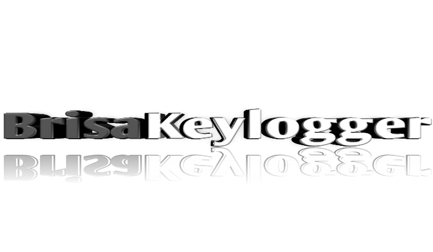

  

<h2>Disclaimer</h2>

    Este software é destinado exclusivamente para fins de estudo, monitoramento e segurança legítimos. A utilização deste software para qualquer atividade ilegal, antiética ou não autorizada é estritamente proibida. O desenvolvedor não assume qualquer responsabilidade pelo uso indevido deste software por terceiros. É responsabilidade do usuário garantir que o uso deste software esteja em conformidade com todas as leis, regulamentos e políticas de privacidade aplicáveis. O uso deste software sem o consentimento expresso de todas as partes envolvidas pode ser ilegal em muitas jurisdições. O desenvolvimento e uso deste software para fins de estudo devem ser conduzidos de maneira ética e responsável.

<h2>Tributo</h2>

  Este programa foi criado como uma forma de lidar com o vazio profundo que sinto após a perda da minha gatinha. Como a programação é uma atividade que me ajuda a escapar da realidade, decidi me concentrar neste projeto. Recentemente, meu interesse se voltou para vírus e segurança da informação, então decidi criar um programa em uma linguagem na qual não tenho muita experiência, não apenas para me manter ocupado, mas também para aprimorar minhas habilidades.

<h2>Funcionamento</h2>

  O arquivo <code>setup.cpp</code> contém o código para a instalação automática do Keylogger na pasta de inicialização do Windows, criando um arquivo em <code>.../Microsoft/Windows/system80.exe</code> e um atalho desse mesmo arquivo na pasta de inicialização.

  O arquivo <code>BrisaKL.cpp</code> é o arquivo do keylogger, que executa em segundo plano, capturando as teclas pressionadas.

